# git-epic

Your GitHub history replayed as an animated cinematic SVG — "The Epic of `<handle>`" — living in your profile README.


Rendered from [`test-fixtures/rich-history-account.json`](test-fixtures/rich-history-account.json) — title card, chapter replay, then a living ambient state. Animation is baked in (SMIL); it plays right here on github.com.

Spec: [`plans/000/git-epic-functional-spec.md`](plans/000/git-epic-functional-spec.md)

## Usage

```ts
import { renderEpic, type HistorySnapshot } from 'git-epic';

const snapshot: HistorySnapshot = {
  handle: 'first-spark',
  accountCreatedDate: '2019-03-14',
  firstPublicActivityDate: '2019-03-20',
  capturedAtDate: '2026-07-04',
  contributionDays: [],
  repositories: [],
};

const svg = renderEpic(snapshot);
// write svg somewhere, embed in a README — animation is baked in (SMIL)
```

Output is deterministic: same snapshot in, byte-identical SVG out.

### Chapters without rendering

`detectChapters` finds the career's chapters from a snapshot; `narrateChapter` turns one into its caption. Same functions `renderEpic` uses internally.

```ts
import { detectChapters, narrateChapter, type Chapter } from 'git-epic';
import { readFileSync } from 'node:fs';

const snapshot = JSON.parse(readFileSync('test-fixtures/rich-history-account.json', 'utf8'));

const chapters: Chapter[] = detectChapters(snapshot);
// [{ kind: 'origin', date: '2018-01-10' },
//  { kind: 'prolificacy', date: '2019-01-01', year: 2019, ... },
//  ...8 chapters total — display-ordered, capped at the 8 most dramatic]

narrateChapter(chapters[0]);
// 'In the year 2018, the developer first set foot upon the public forge, and the epic began.'
```

Seven chapter kinds: origin, dark age, great streak, prolificacy, flagship rise, star milestone, language era. Detection is mechanical — thresholds and precedence live in the spec.

### Render a fixture locally

```sh
pnpm render-fixture test-fixtures/rich-history-account.json
# writes temp/rich-history-account.svg — open it in a browser to watch the replay
```

Optional second arg sets the output path.

### Capture a live GitHub handle locally

```sh
pnpm capture-github-snapshot mohasarc test-fixtures/mohasarc-captured.json --force
pnpm render-github-handle mohasarc examples/stage-4-live/mohasarc.svg
```

Live capture uses public logged-out GitHub data. Expected outcomes are distinct: missing user, organization account, and rate limit.

## Image endpoint

`GET /<handle>.svg` returns HTTP 200 with an animated SVG for any input — no auth, embed it straight in a README. Response is byte-identical for every viewer inside the freshness window, so the camo proxy can cache it.

Four served states:

| Input | Served |
| --- | --- |
| Fresh cached epic (< 24h) | stored epic, no upstream fetch |
| Stale or uncached handle | live fetch → rendered epic, cached |
| Missing user, org account, or bad handle | "no such legend" card |
| Upstream down or rate-limited | last-good epic if cached, else "still being written" placeholder |

A `.svg` request never returns a broken image: any unexpected error falls back to the placeholder at 200. `Cache-Control` carries `max-age` down to the epic's 24h freshness boundary (min 300s); cards and placeholders use `max-age=300`.

The two fallback cards:





### Worlds

The mural preview (`?preview=mural`) renders in one of three worlds — desert, river,
mountain — each with its own ancient → classical → modern material vocabulary. World is
pure taste: it never encodes anything about the user, so the same history reads the same in
every world. Only palette and two per-world signatures (the ancient-opener camp and a world
prop) change; every landmark, motif, and plaque stays shared and recolored.

`?world=desert|river|mountain` picks one:

| request | world |
| --- | --- |
| `?preview=mural&world=river` | river |
| `?preview=mural&world=mountain` | mountain |
| `?preview=mural` (absent) | hash default off the handle |
| `?preview=mural&world=River` (wrong case / unknown) | hash default off the handle |

Any value that is not a lowercase-exact match hash-defaults to a stable world for that
handle (`WORLD_NAMES[hash(handle) % 3]`), so every handle gets a world with no parameter.
Rendering stays deterministic: `identical (data, world) → identical bytes`. Side-by-side
samples: [`examples/stage-4-worlds/`](examples/stage-4-worlds/).

### Run the server

```sh
pnpm start          # listens on http://localhost:8080
PORT=3000 pnpm start
```

`http.createServer` binds `routeServiceRequest` and computes `nowIso` per request. Non-`.svg` paths → 404; non-GET (except HEAD) → 405.

### Deploy

Single Node origin. The epic cache lives in process memory, so it must run as one instance — two machines would serve divergent documents. `fly.toml` pins `min_machines_running = 1` with `auto_stop_machines = false` and no autoscale; `Dockerfile` runs `pnpm start`.

```sh
fly deploy
```

Actual deploy and the placeholder domain are not provisioned yet — they need a Fly account and credentials outside this repo. The config is committed and ready.
