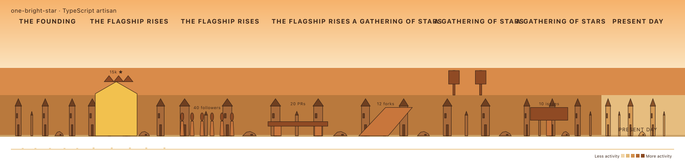
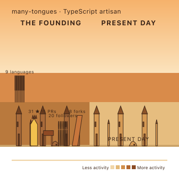

# Phase 7 — motif render layer

`renderMotifs(eras, worldScale)` draws the motifs `placeMotifs` attached to each era,
inserted after structures and before the ribbon. Color is decided here (per Stage 1):
the star gate and the spike monument take `GOLD_ACCENT`; a banner takes
`LANGUAGE_ACCENT[label]`, or the neutral accent for an unknown language. Count-atom kinds
(`crowd`, boulevard `banner`) repeat left-to-right within their lane; scale-driven kinds
(`crownGate`, `bridge`, `noticeBoard`, `sideRoad`) grow one atom by tier. `standout` adds a
1.5× scale and gold. Plaques ride above each motif via the shared `svg-text` primitive.

These murals apply `placeMotifs` to the built scene; `build-mural-scene` wires that in at
Phase 9, so the top-level `renderMural` still shows no motifs yet.

## star-heavy — spike monument, gold gate, plaques

Gold standout `crownGate` (`15k ★`) towering over the widest era, plus `40 followers`
crowd, `20 PRs` bridge, `12 forks` side-road, `10 issues` notice-board.

## polyglot — boulevard banner

Eight banner atoms clamped to `MAX_BOULEVARD_BANNERS` with the true-count plaque
`9 languages`, hung in the sky band above the road.

## accent lookup

| motif | fill |
| --- | --- |
| `crownGate` / `standout` | `GOLD_ACCENT` |
| `banner` with known `label` | `LANGUAGE_ACCENT[label]` |
| `banner` with unknown `label` | `structureAccent` (neutral) |
| other kinds | `structureBody` |
