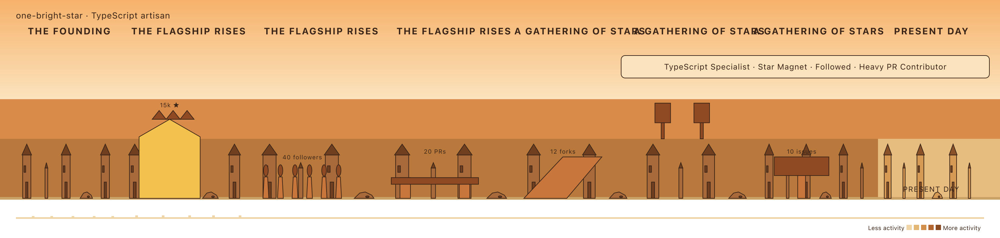
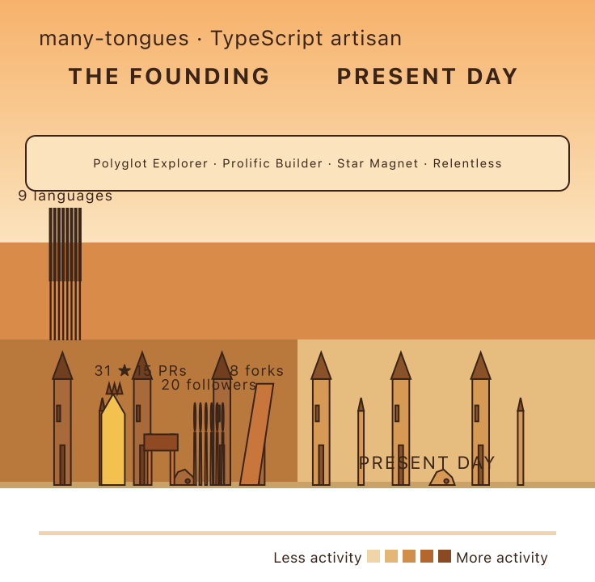
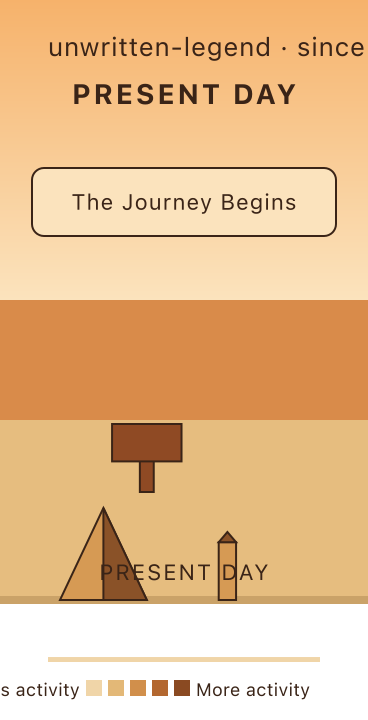

# Phase 8 — badge finale render layer

`renderBadgeFinale(scene)` draws the climax panel: a content-sized warm plaque at the
present-day right region of the sky band, listing `scene.badges` as one middle-dot line
via the shared `svg-text` primitive. Inserted topmost in `render-mural-svg`, after the
strip text. Sized to its text, never clamped to an era. Sits in the y 84–118 band, below
era titles (y 52) and above metropolis rooftops (~y 172). Every label and plaque escaped.

`build-mural-scene` still leaves `scene.badges` empty (wired in Phase 9), so the empty
guard returns `''` and the top-level `renderMural` shows no panel yet. These murals inject
`deriveBadges` (and `placeMotifs`) to render the finale in context.

## star-heavy — four badges

`TypeScript Specialist · Star Magnet · Followed · Heavy PR Contributor`, right-anchored
over the present-day stretch.

## polyglot — mixed badges

`Polyglot Explorer · Prolific Builder · Star Magnet · Relentless`.

## brand-new — the journey begins

Single `The Journey Begins` badge, no dangling separator.

