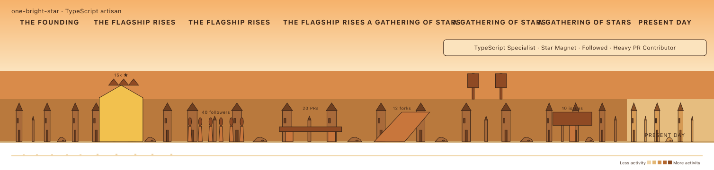
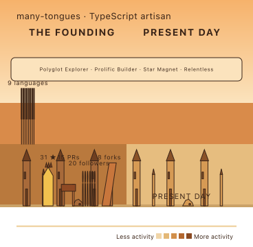
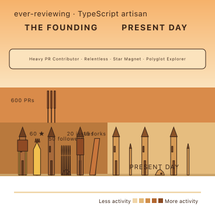
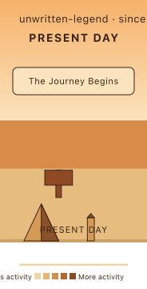

# Phase 9 — motifs and badges wired into the mural

`build-mural-scene` now runs `placeMotifs` (attaches motifs to placed eras) and
`deriveBadges` (fills `scene.badges`). `renderMural` draws both. Same data in, same bytes
out — no seed, no clock. The cosmic embed and every other Stage-1 golden stay untouched.

The four murals below come straight from `pnpm render-mural`. Each calibrated profile
reads as a different emphasis, driven by its own strengths — not manufactured novelty.

## star-heavy — stars spike

Gold crown-gate monument (`standout`) with a `N ★` plaque in the widest era.
Badges: `TypeScript Specialist · Star Magnet · Followed · Heavy PR Contributor`.

## polyglot — language boulevard

Row of banners, one per distinct language, tinted by `LANGUAGE_ACCENT`.
Badges: `Polyglot Explorer · Prolific Builder · Star Magnet · Relentless`.

## pr-heavy — PR bridge

A bridge span carrying a `N PRs` plaque.
Badges: `Heavy PR Contributor · Relentless · Star Magnet · Polyglot Explorer`.

## brand-new — grace floor

Zero activity still renders a complete, hopeful scene: one neutral plaque-free motif in
the single present-day era, and the generic `The Journey Begins` badge — never a titled
strength, never a `0 ★` gate.

