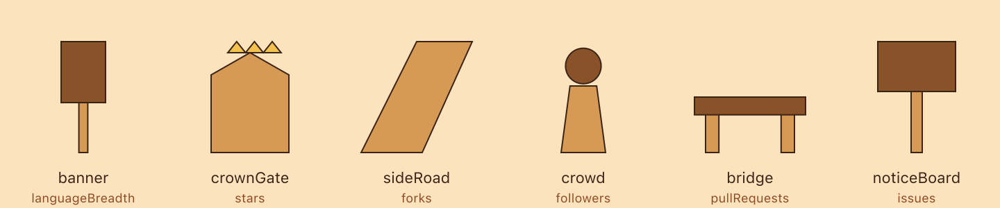

# Phase 6 — motif module silhouettes

Six atomic single-silhouette shapes, each `(opts: { fill, heightScale }) => string`, drawn
in the normalized box (x 0..1, y 0..−heightScale, standing on y=0). Multiplicity, lanes, and
accent lookup are later phases; this phase is one atom per kind.

Gallery below: each module at `heightScale: 1`, filled `STRUCTURE_FILL.modern`; `crownGate`
shown with `GOLD_ACCENT` on its crown (the standout accent the render layer applies).

| module | file | motif kind | dimension |
| --- | --- | --- | --- |
| banner | `modules/banner.ts` | `banner` | languageBreadth |
| crownGate | `modules/crown-gate.ts` | `crownGate` | stars |
| sideRoad | `modules/side-road.ts` | `sideRoad` | forks |
| crowd | `modules/crowd.ts` | `crowd` | followers |
| bridge | `modules/bridge.ts` | `bridge` | pullRequests |
| noticeBoard | `modules/notice-board.ts` | `noticeBoard` | issues |

Path budgets (`MODULE_PATH_BUDGET`): banner 3, crownGate 4, sideRoad 2, crowd 3, bridge 4,
noticeBoard 3.
